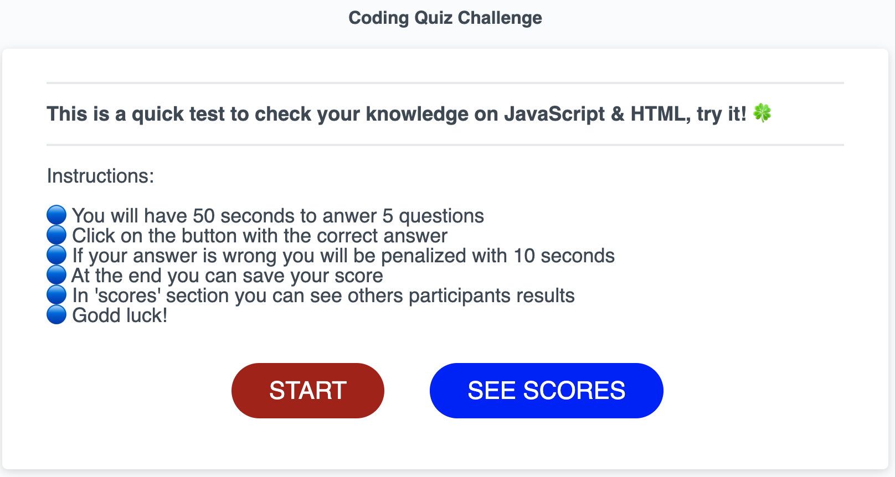
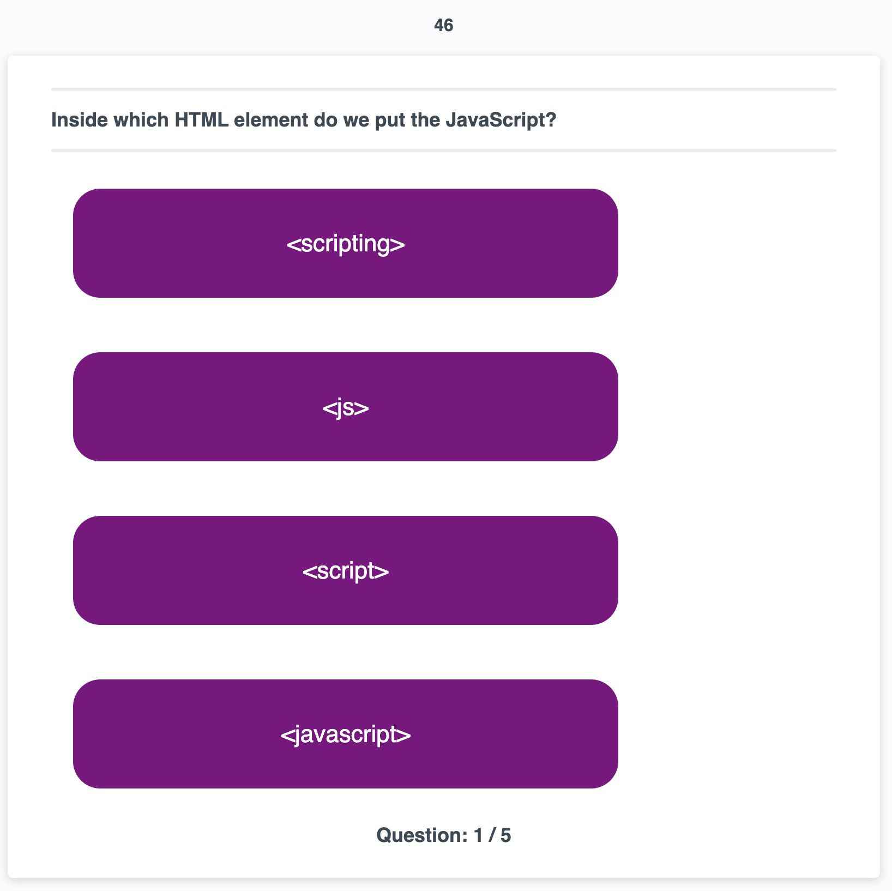
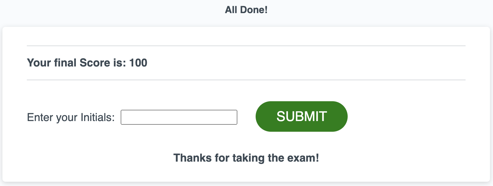
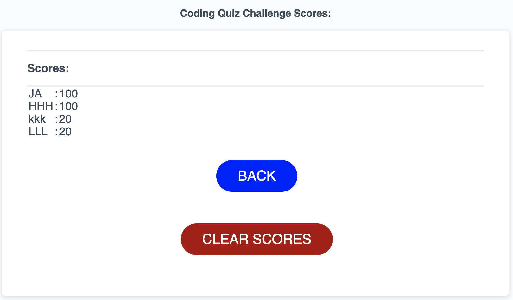

# WebQuiz

Development quick quiz for JavaScript &amp; HTML.

Read below before entering the link:
[Quick Quiz](https://jaime-a-esquivel-a.github.io/WebQuiz/Develop/index.html)

- Follow the instructions that you will find in the start Page.
 

- Choose your answer by clicking one of the buttons with anser options.
 

- Check your results and save your score.
 

- You can check others participants results on the Scores Section.
 

